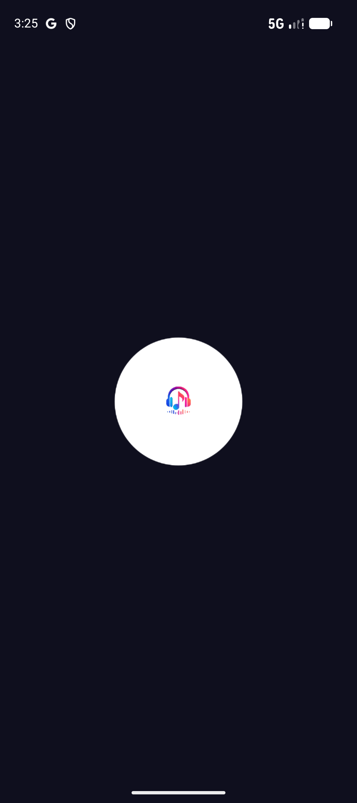
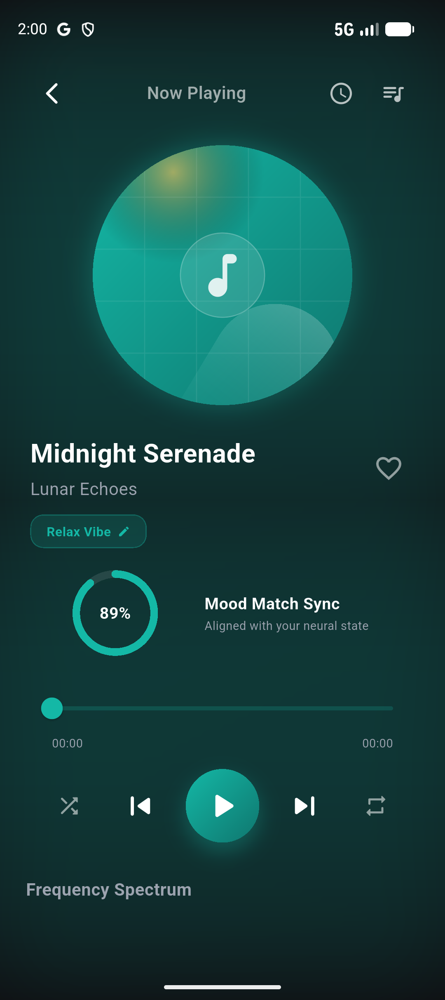
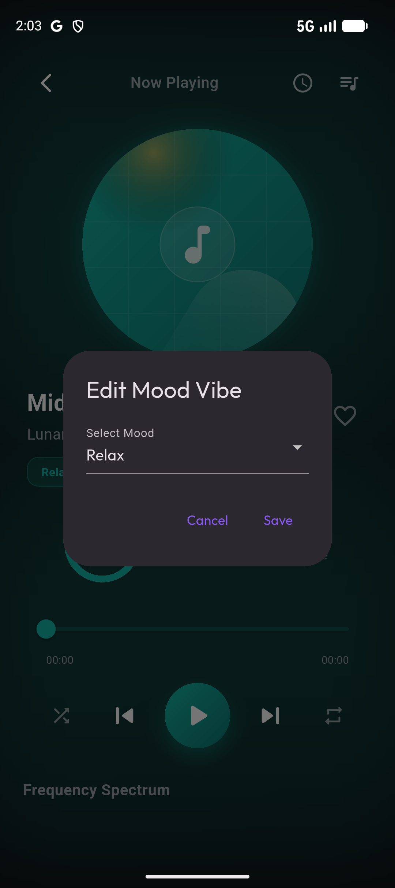
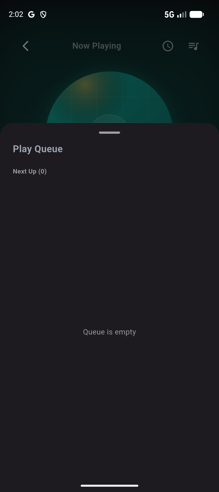
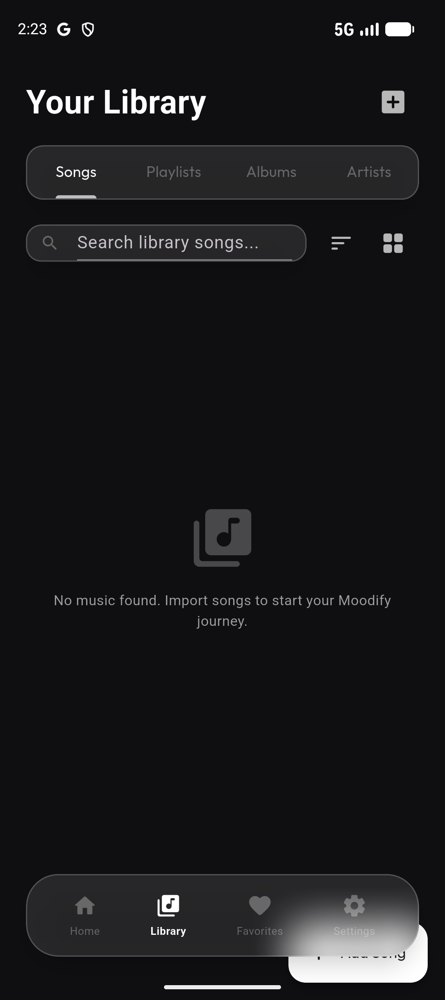
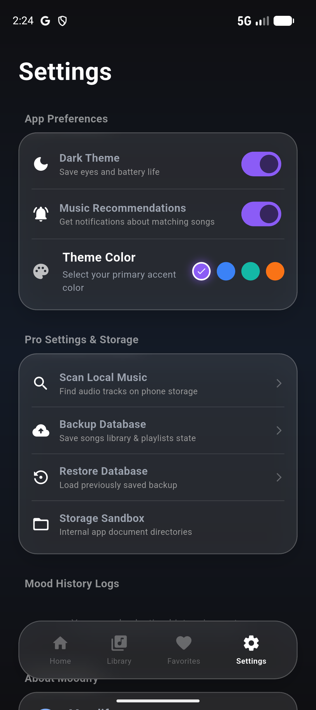
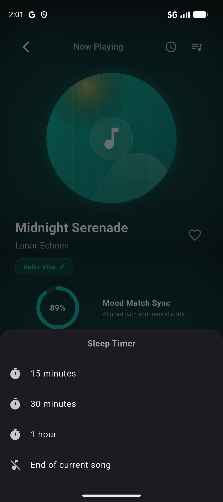
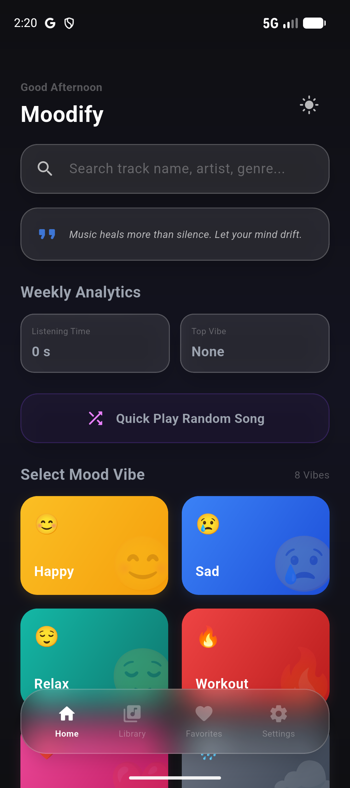

# Moodify

Premium Offline Music Player built with Flutter. Design matching your emotions, offering offline playback, smart mood tracking, and database synchronization.

## Tagline

> "Music that matches your mood."

## Features

• **Offline Music Player**: Premium playback features including seek bar, shuffle, repeat, play queue, and dynamic waveforms.
• **Mood-Based Playlists**: Automatically groups your track library by distinct moods (Happy, Sad, Relax, Workout, Study, Sleep, Romantic, Lonely, Motivation, Calm, Energetic).
• **Local Music Import**: Copy selected files into application secure local storage from any phone directory.
• **Device Music Scanner**: Auto-scan device directory storage using localized metadata extractors.
• **Background Playback**: Continuous media streaming with notification and lock screen controls.
• **Queue Manager**: Visual drag-and-drop queue management.
• **Favorites**: Curate and search your favorited track list offline.
• **Mini Player**: Bottom bar controls visible across screens with swipe up/down expand/minimize gestures.
• **Dynamic Material 3 Theme**: Layout and colors seed matching current cover art or user preferences.
• **Sleep Timer**: Schedule playback turn-offs (15m, 30m, 1h, end of track).
• **Statistics Dashboard**: Dashboard highlighting most played, listening time metrics, and mood history logs.
• **Hive Local Database**: High performance, type-safe local storage databases.

## Tech Stack

* **Framework**: Flutter (3.44.4)
* **Language**: Dart
* **Database**: Hive Local Database (Type-Safe adapters)
* **State Management**: Provider
* **Audio Core**: just_audio & audio_service
* **Metadata & Query**: on_audio_query & permission_handler
* **Design Guidelines**: Material 3 (with Google Fonts Outfit typography)

## Project Structure

```text
lib/
├── core/
│   ├── constants/       # Accent colors & mood gradients
│   ├── theme/           # Dynamic Material 3 theme builders
│   └── utils/           # Page transition helpers
├── models/              # Hive adapters for Song & Playlist schemas
├── providers/           # App state managers (Song, Theme providers)
├── screens/             # UI screen panels (Home, Library, Player, Settings)
├── services/            # Audio Service & Storage persistence interfaces
└── widgets/             # Reusable UI widgets (MiniPlayer, Equalizer, Cards)
```

## Installation

1. Clone this repository:
   ```bash
   git clone https://github.com/hemanthkumar-del/MoodTunes-Pro.git
   ```
2. Navigate to the project directory:
   ```bash
   cd MoodTunes-Pro
   ```
3. Fetch dependencies:
   ```bash
   flutter pub get
   ```
4. Build the application for Android:
   ```bash
   flutter build apk --release
   ```

## 📸 Screenshots

| Splash Screen | Home Dashboard | Music Player |
| :---: | :---: | :---: |
|  |  |  |

| Mood Selection | Play Queue | Your Library |
| :---: | :---: | :---: |
|  |  |  |

| Settings | Sleep Timer | Weekly Statistics |
| :---: | :---: | :---: |
|  |  |  |


## APK Download

The compiled production release bundle is available inside the GitHub Releases tab:
👉 **[Download APK v1.2.1](https://github.com/hemanthkumar-del/Moodify/releases/download/v1.2.1/app-release.apk)**

## Future Improvements

* Dynamic cross-fading support.
* Localized network backup database mirrors.
* Automatic lyrics finder syncs.

## License

This project is licensed under the MIT License - see the LICENSE file for details.
